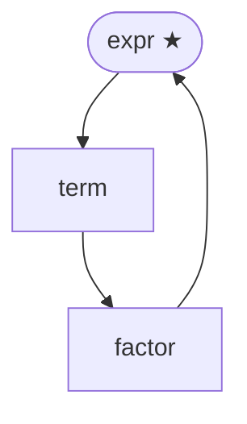

# tree-sitter-bnf-tools

[](https://github.com/ambs/tree-sitter-bnf-tools/actions/workflows/ci.yml)
[](https://codecov.io/gh/ambs/tree-sitter-bnf-tools)
[](https://ambs.github.io/tree-sitter-bnf-tools/)

A [tree-sitter](https://tree-sitter.github.io/) grammar for BNF, plus a CLI tool
that converts BNF grammars into tree-sitter `grammar.js` notation.

New to the tool? Start with the **[tutorial](docs/tutorial/01-getting-started.md)**
for a guided introduction with examples, or browse the
**[documentation index](docs/index.md)**. Want syntax highlighting in your
editor? See the **[editor setup guide](docs/editors.md)**.

## Repository structure

| Directory | Description |
|-----------|-------------|
| `tree-sitter-bnf/` | Tree-sitter grammar and language bindings (Rust, Node.js, C) |
| `tools/` | `ts-bnf-tool` CLI — converts BNF files to tree-sitter notation |
| `grammar/` | The BNF dialect described in itself, with generated diagrams |

Both modules are independent and can be split into separate repositories in the future.

## The BNF dialect

Write your grammar in a compact BNF dialect:

```bnf
# arithmetic expressions
expr   -> term ('+' term)* ;
term   -> factor ('*' factor)* ;
factor -> /[0-9]+/ | '(' expr ')' ;
```

and `ts-bnf-tool convert` turns it into a ready-to-use `grammar.js`:

```js
module.exports = grammar({
  name: "expr",

  rules: {
    expr: $ => seq($.term, repeat(seq('+', $.term))),
    term: $ => seq($.factor, repeat(seq('*', $.factor))),
    factor: $ => choice(/[0-9]+/, seq('(', $.expr, ')')),
  }
});
```

The dialect supports the full tree-sitter feature set:

| Construct | Syntax | Details |
|-----------|--------|---------|
| Rule | `name -> body ;` | [Syntax](docs/tutorial/02-syntax.md) |
| Comment | `# text` | [Syntax](docs/tutorial/02-syntax.md) |
| Literal / pattern terminal | `'text'`, `'\n'`, `/regex/`, `/regex/i` | [Terminals](docs/tutorial/02-syntax.md#terminals-literals-and-patterns) |
| Alternative | `a \| b` | [Rules](docs/tutorial/02-syntax.md#rules-and-alternatives) |
| Quantifiers | `*` `+` `?` | [Quantifiers](docs/tutorial/02-syntax.md#quantifiers) |
| Grouping | `( )` | [Sequences](docs/tutorial/02-syntax.md#sequences-and-grouping) |
| Token expressions | `<< >>`, `<<! >>` | [Tokens](docs/tutorial/02-syntax.md) |
| Field label | `name: symbol` | [Fields](docs/tutorial/02-syntax.md#field-labels) |
| Alias group | `(body => name)` | [Aliases](docs/tutorial/02-syntax.md#alias-groups) |
| Precedence | `%prec`, `%prec.left`, … | [Precedence](docs/tutorial/02-syntax.md#precedence-annotations) |
| Directives | `%axiom`, `%word`, `%conflicts`, `%precedences`, `%inline`, `%supertypes`, `%extras`, `%include` | [Directives](docs/tutorial/03-directives.md) |

The full mapping fits on one page: see the
[BNF → tree-sitter cheat sheet](docs/tutorial/04-cheatsheet.md). Constructs
from other BNF/EBNF variants (`::=`, `<expr>`, `[optional]`, `{repetition}`, …)
are [not supported](docs/tutorial/02-syntax.md#what-is-not-supported).

## ts-bnf-tool

Install from crates.io:

```sh
cargo install ts-bnf-tool
```

Usage:

```sh
ts-bnf-tool <SUBCOMMAND> [OPTIONS] <file.bnf>   # pass - to read from stdin
```

| Subcommand | Purpose | Documentation |
|------------|---------|---------------|
| `convert` | Convert BNF to `grammar.js` | [End-to-end workflow](docs/tutorial/05-end-to-end.md) |
| `highlights` | Generate a skeleton `highlights.scm` | [End-to-end workflow](docs/tutorial/05-end-to-end.md#step-5--refine-the-highlights-skeleton) |
| `check` | Run static checks; exit non-zero on any issue | [Analysing a grammar](docs/tutorial/06-analysing.md) |
| `firsts` | Print FIRST sets for each rule | [Analysing a grammar](docs/tutorial/06-analysing.md#inspecting-first-sets) |
| `format` | Pretty-print a `.bnf` file in canonical style | [Formatting and refactoring](docs/tutorial/07-refactoring.md) |
| `rename` | Rename a rule and all its references | [Formatting and refactoring](docs/tutorial/07-refactoring.md#renaming-a-rule) |
| `railroad` | Generate railroad / syntax diagrams as SVG | [Visualising a grammar](docs/tutorial/08-visualising.md) |
| `graph` | Emit a rule-dependency graph (DOT / Mermaid / SVG / PDF / PNG) | [Visualising a grammar](docs/tutorial/08-visualising.md#rule-dependency-graph) |

## Visualising grammars

Both diagrams below are generated by the tool itself from the arithmetic
grammar shown above:

```bnf
# arithmetic expressions
expr   -> term ('+' term)* ;
term   -> factor ('*' factor)* ;
factor -> /[0-9]+/ | '(' expr ')' ;
```

`ts-bnf-tool railroad` draws railroad / syntax diagrams:


`ts-bnf-tool graph` emits rule-dependency graphs (here as Mermaid):



For a real-world example, the BNF dialect's own grammar
([`grammar/bnf.bnf`](grammar/bnf.bnf)) has a generated
[railroad diagram](grammar/railroad.svg) (SVG) and
[rule-dependency graph](grammar/graph.pdf) (PDF).

## Development

```sh
make            # show all available targets
make build      # build both crates
make test       # run Rust tests (generates parser.c if needed)
make test-grammar  # run tree-sitter corpus tests
make lint       # clippy
make fmt        # rustfmt
make clean      # remove build artifacts
```

Requires: Rust (stable), `tree-sitter-cli` ≥ 0.24.4 (`npm install -g tree-sitter-cli`).

## Contributing

Planned improvements and known limitations are tracked as
[GitHub issues](https://github.com/ambs/tree-sitter-bnf-tools/issues). If you
have an idea for a new feature, a construct that is missing, or a bug to report,
please open an issue — all feedback is welcome.

Pull requests are also welcome. Before opening one, please read the checklist
in [CLAUDE.md](CLAUDE.md) and make sure `make check` passes.

## License

MIT
