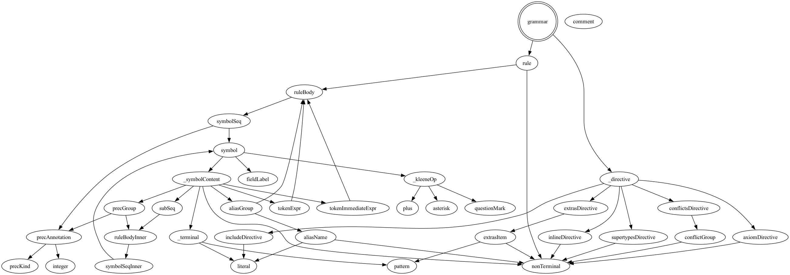
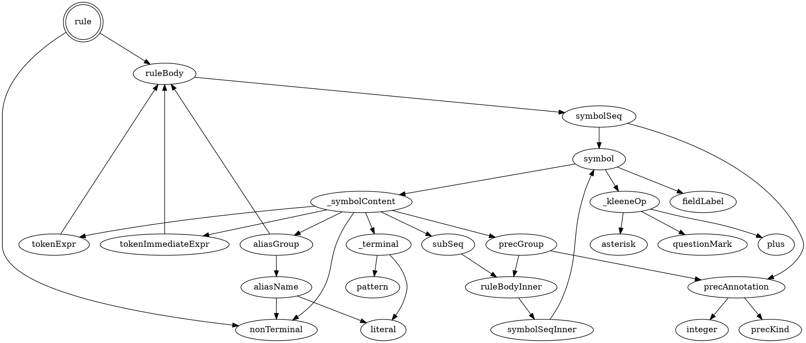
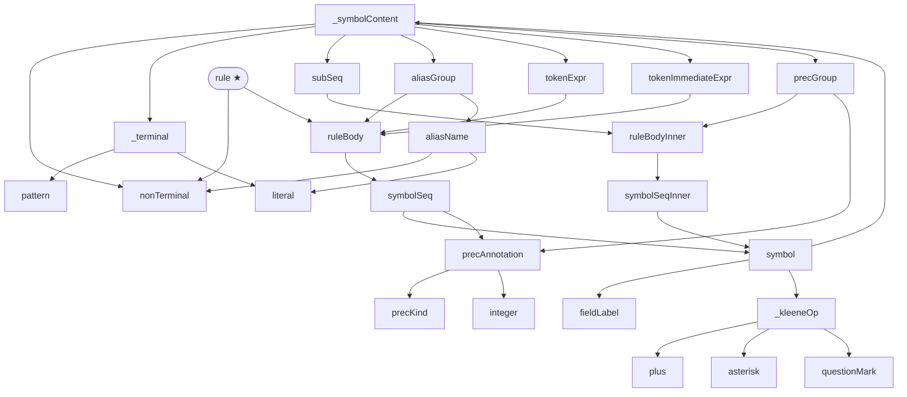

# ts-bnf-tool Tutorial

This tutorial walks you through `ts-bnf-tool` from scratch — what it does, why
it exists, and how to use it to write a working tree-sitter grammar.

## The problem

[Tree-sitter](https://tree-sitter.github.io/) grammars are written in JavaScript.
Not configuration — actual JavaScript, calling a DSL of functions: `seq()`,
`choice()`, `repeat()`, `optional()`, `token()`, and so on. Here is a small
fragment describing arithmetic expressions:

```js
module.exports = grammar({
  name: "expr",

  rules: {
    expr: $ => choice(
      seq($.expr, '+', $.expr),
      seq($.expr, '*', $.expr),
      $.number,
      seq('(', $.expr, ')'),
    ),
    number: $ => /[0-9]+/,
  }
});
```

It works. But the syntactic structure of the language you are describing is
buried under layers of JavaScript boilerplate. For a small grammar it is
manageable; for a real language it quickly becomes hard to read at a glance.

## The solution

`ts-bnf-tool` lets you write the same grammar in a compact BNF dialect and
generates the `grammar.js` for you:

```bnf
expr   -> expr '+' expr
        | expr '*' expr
        | number
        | '(' expr ')'
        ;
number -> /[0-9]+/ ;
```

The language is what you see. The structure is immediately apparent.

## A complete first example

Create a file called `expr.bnf`:

```bnf
# arithmetic expressions
expr -> term ('+' term)* ;
term -> /[0-9]+/ | '(' expr ')' ;
```

Run the tool:

```sh
ts-bnf-tool convert expr.bnf
```

Output:

```js
module.exports = grammar({
  name: "expr",

  rules: {
    expr: $ => seq($.term, repeat(seq('+', $.term))),
    term: $ => choice(/[0-9]+/, seq('(', $.expr, ')')),
  }
});
```

That is a ready-to-use `grammar.js`. Every BNF construct maps to exactly one
tree-sitter DSL call — there is no hidden magic.

---

## Syntax walkthrough

### Rules and alternatives

A rule is written as:

```
name -> body ;
```

The body is a sequence of symbols separated by `|` for alternatives. The
semicolon is required at the end of every rule.

```bnf
color -> 'red' | 'green' | 'blue' ;
```

generates:

```js
color: $ => choice('red', 'green', 'blue'),
```

### Terminals: literals and patterns

A **literal** is a quoted string — single or double quotes both work:

```bnf
arrow -> '->' ;
kw_if -> "if" ;
```

A **pattern** is a regex delimited by slashes:

```bnf
ident  -> /[A-Za-z_][A-Za-z0-9_]*/ ;
number -> /[0-9]+/ ;
```

Patterns follow JavaScript regex syntax (tree-sitter uses a JS regex engine).

### Sequences and grouping

Juxtaposition means sequence. Parentheses group without creating a named rule:

```bnf
pair    -> '(' expr ',' expr ')' ;
sep_seq -> item (',' item)* ;
```

### Quantifiers

| Syntax | Meaning | Maps to |
|--------|---------|---------|
| `x*`   | zero or more | `repeat(x)` |
| `x+`   | one or more  | `repeat1(x)` |
| `x?`   | optional     | `optional(x)` |

Quantifiers bind to the immediately preceding symbol or group:

```bnf
args -> '(' (expr (',' expr)*)? ')' ;
```

### Token expressions: `<< >>` and `<<! >>`

By default, tree-sitter allows whitespace and extras between any two tokens.
`<< >>` forces the enclosed expression to be treated as a single atomic lexer
token — no whitespace is allowed inside:

```bnf
identifier -> << /[A-Za-z_]/ /[A-Za-z0-9_]*/ >> ;
```

generates:

```js
identifier: $ => token(seq(/[A-Za-z_]/, /[A-Za-z0-9_]*/)),
```

`<<! >>` goes further: it also requires that no whitespace precedes the token.
This is useful for suffixes that must be attached to the preceding token:

```bnf
negative -> '-' <<! /[0-9]+/ >> ;
```

generates:

```js
negative: $ => seq('-', token.immediate(/[0-9]+/)),
```

Use `<< >>` when you want a multi-part terminal (e.g. a number followed by a
unit). Use `<<! >>` when the token must be glued to whatever comes before it
(e.g. a postfix operator, a type suffix like `u32`).

### Field labels

A field label annotates a symbol with a named field in the AST, using
tree-sitter's `field()`:

```bnf
assign -> target: ident '=' value: expr ;
```

generates:

```js
assign: $ => seq(field('target', $.ident), '=', field('value', $.expr)),
```

The colon must be attached to the label name (no space before it). A space
after the colon is optional. Field labels compose with quantifiers:

```bnf
call -> func: ident '(' args: expr* ')' ;
```

generates `field('args', repeat($.expr))`.

### Alias groups

An alias group relabels a sequence in the generated AST using `alias()`. The
`=>` separator divides the body from the target name:

```bnf
param_list -> '(' (name type => parameter)* ')' ;
```

generates:

```js
param_list: $ => seq('(', repeat(alias(seq($.name, $.type), $.parameter)), ')'),
```

The target name is either a bare identifier (a named node) or a quoted string
(an anonymous node):

```bnf
true_kw -> ('t' 'r' 'u' 'e' => 'true') ;
```

#### How aliases behave

The alias name is a **display label** in the resulting syntax tree, not a
rule reference: the body does all the parsing, and the resulting node is
merely renamed. The name does not need to exist as a rule — and if a rule
with the same name *does* exist, the alias neither invokes nor references
it. Consequently, `check` does not count alias names as rule references: an
undefined alias label is not an `undefined rule reference`, and a rule
mentioned *only* as an alias label is still reported as never referenced
(it can never produce a node).

What the parse tree looks like, for each alias form:

- **Bare identifier → named node.** Given

  ```bnf
  member -> object: identifier '.' ( identifier => property_name ) ;
  ```

  parsing `foo.bar` yields

  ```
  (member
    object: (identifier)    ; "foo"
    (property_name))        ; "bar" — parsed by identifier, displayed as property_name
  ```

- **Quoted string → anonymous node.** Given

  ```bnf
  true_kw -> ( 't' 'r' 'u' 'e' => 'true' ) ;
  ```

  parsing `true` yields an *anonymous* node, exactly as if the rule body had
  been the plain string `'true'`: it does not appear as a named node in the
  tree and is only visible to queries via the `"true"` anonymous-node
  syntax.

### Precedence annotations

Precedence annotations wrap an alternative in a `prec()` call, resolving
ambiguities in the grammar:

```bnf
expr -> expr '+' expr  %prec.left 1
      | expr '*' expr  %prec.left 2
      | expr '^' expr  %prec.right 3
      | '-' expr       %prec 4
      ;
```

generates:

```js
expr: $ => choice(
  prec.left(1, seq($.expr, '+', $.expr)),
  prec.left(2, seq($.expr, '*', $.expr)),
  prec.right(3, seq($.expr, '^', $.expr)),
  prec(4, seq('-', $.expr)),
),
```

The four annotation kinds:

| Annotation | Level | Maps to |
|---|---|---|
| `%prec N` | required | `prec(N, ...)` |
| `%prec.left` or `%prec.left N` | optional | `prec.left([N,] ...)` |
| `%prec.right` or `%prec.right N` | optional | `prec.right([N,] ...)` |
| `%prec.dynamic N` | required | `prec.dynamic(N, ...)` |

To annotate a sub-expression rather than a whole alternative, wrap it in
parentheses with `%prec` inside:

```bnf
rule -> (a | b %prec 1) c ;
```

---

## Grammar-level directives

Directives appear at the top of the file (before or after rules; order does
not matter) and configure the generated `grammar.js`.

### `%extras`

Declares tokens that may appear anywhere in the input — typically whitespace
and comments:

```bnf
%extras /\s/, comment
```

generates:

```js
extras: $ => [/\s/, $.comment],
```

Without this directive, tree-sitter's built-in default (skip whitespace
everywhere) applies.

### `%conflicts`

Declares rule pairs that are expected to be ambiguous, allowing tree-sitter's
GLR parser to resolve them at parse time rather than aborting grammar
generation:

```bnf
%conflicts [expr, term]
%conflicts [foo, bar, baz], [a, b]
```

generates:

```js
conflicts: $ => [
  [$.expr, $.term],
  [$.foo, $.bar, $.baz],
  [$.a, $.b],
],
```

### `%inline`

Lists rules to substitute at every call site during parser-table generation.
Typically used for hidden helper rules that exist as structural glue:

```bnf
%inline _helper, _wrapper
```

### `%supertypes`

Lists abstract rule names that act as union types over concrete subtypes. This
enriches the type annotations in language bindings:

```bnf
%supertypes expression, statement, declaration
```

### `%axiom`

Declares an explicit root (start) rule. Without `%axiom`, tree-sitter treats
the *first rule declared* as the start symbol. Use `%axiom` when you want to
debug a sub-rule in isolation — temporarily redirect the entry point without
rearranging the file:

```bnf
%axiom expr

top_level -> stmt+ ;
expr      -> term ('+' term)* ;
term      -> /[0-9]+/ ;
```

`convert` silently emits `expr` first in `grammar.js`'s `rules:` block so
tree-sitter uses it as the start symbol, while the BNF file keeps its original
declaration order.

Declaring `%axiom` more than once is an **error**, as is naming a rule that is
not defined anywhere in the file.

---

## BNF → tree-sitter cheat sheet

| BNF | tree-sitter JS | Notes |
|-----|---------------|-------|
| `name -> body ;` | `name: $ => body` | Rule definition |
| `a b c` | `seq(a, b, c)` | Sequence |
| `a \| b \| c` | `choice(a, b, c)` | Alternatives |
| `x*` | `repeat(x)` | Zero or more |
| `x+` | `repeat1(x)` | One or more |
| `x?` | `optional(x)` | Zero or one |
| `(body)` | inline group | No new rule created |
| `'text'` | `'text'` | Literal string |
| `/regex/` | `/regex/` | Pattern |
| `<< body >>` | `token(body)` | Atomic lexer token |
| `<<! body >>` | `token.immediate(body)` | Immediate token (no leading whitespace) |
| `label: sym` | `field('label', sym)` | Named AST field |
| `(body => name)` | `alias(body, $.name)` | Named alias |
| `(body => 'str')` | `alias(body, 'str')` | Anonymous alias |
| `body %prec N` | `prec(N, body)` | Precedence |
| `body %prec.left N` | `prec.left(N, body)` | Left-associative precedence |
| `body %prec.right N` | `prec.right(N, body)` | Right-associative precedence |
| `body %prec.dynamic N` | `prec.dynamic(N, body)` | Dynamic precedence |
| `%axiom r` | *(emits `r` first in `rules:`)* | Explicit start rule |
| `%conflicts [r1, r2]` | `conflicts: $ => [[$.r1, $.r2]]` | Conflict declaration |
| `%inline r` | `inline: $ => [$.r]` | Inline rule |
| `%supertypes r` | `supertypes: $ => [$.r]` | Supertype declaration |
| `%extras /x/, r` | `extras: $ => [/x/, $.r]` | Extra tokens |
| `# comment` | *(removed)* | Line comment |

---

## End-to-end: from `.bnf` to a working parser

### Step 1 — write the grammar

Save your grammar to a `.bnf` file, say `json.bnf`:

```bnf
%extras /\s/

value   -> object | array | string | number | 'true' | 'false' | 'null' ;
object  -> '{' (pair (',' pair)*)? '}' ;
pair    -> key: string ':' val: value ;
array   -> '[' (value (',' value)*)? ']' ;
string  -> << '"' /([^"\\]|\\.)*/ '"' >> ;
number  -> /\-?[0-9]+(\.[0-9]+)?([eE][+-]?[0-9]+)?/ ;
```

### Step 2 — preview the output

Use `--rules-only` for a quick look at just the rule bodies without the
boilerplate wrapper — handy when iterating:

```sh
ts-bnf-tool convert --rules-only json.bnf
```

```
value  -> choice($.object, $.array, $.string, $.number, 'true', 'false', 'null')
object -> seq('{', optional(seq($.pair, repeat(seq(',', $.pair)))), '}')
pair   -> seq(field('key', $.string), ':', field('val', $.value))
array  -> seq('[', optional(seq($.value, repeat(seq(',', $.value)))), ']')
string -> token(seq('"', /([^"\\]|\\.)*/, '"'))
number -> /\-?[0-9]+(\.[0-9]+)?([eE][+-]?[0-9]+)?/
```

### Step 3 — generate a full grammar.js

Without any extra flags, `ts-bnf-tool convert` prints a complete `grammar.js`
to stdout. Redirect it to a file:

```sh
ts-bnf-tool convert json.bnf > grammar.js
```

You can also read from stdin by passing `-` as the filename, which is useful
in pipelines:

```sh
cat json.bnf | ts-bnf-tool convert - > grammar.js
```

When reading from stdin the grammar name defaults to `grammar`; use `--name`
to set a specific name:

```sh
cat json.bnf | ts-bnf-tool convert --name json - > grammar.js
```

### Step 4 — generate a ready-to-use tree-sitter project

`--generate` writes `grammar.js` and a skeleton `queries/highlights.scm` to a
directory, then runs `tree-sitter generate` to produce the C parser:

```sh
ts-bnf-tool convert --generate json.bnf
# creates ./json/grammar.js, ./json/queries/highlights.scm, and ./json/src/parser.c
```

Override the output directory and grammar name:

```sh
ts-bnf-tool convert --generate --output-dir ~/parsers/json --name json json.bnf
```

The resulting directory is a complete tree-sitter language package, ready for
`tree-sitter parse`, editor integration, or publishing as an npm package.

### Step 5 — refine the highlights skeleton

The generated `queries/highlights.scm` is a starting point based on naming
conventions. Open it and replace every `; TODO: @???` line with the appropriate
capture name, or delete it if the rule does not need highlighting.

You can also generate or regenerate the skeleton at any time with the
`highlights` subcommand:

```sh
ts-bnf-tool highlights json.bnf -o queries/highlights.scm
```

Use `--no-todos` to emit only the rules that were automatically classified,
leaving the unknowns out entirely:

```sh
ts-bnf-tool highlights --no-todos json.bnf
```

---

---

## Analysing a grammar

### Checking for issues

`ts-bnf-tool check` runs all static checks on a grammar file and exits with a
non-zero status if any issue is found. This makes it easy to wire into a CI
pipeline:

```sh
ts-bnf-tool check json.bnf
echo $?   # 0 if clean, 1 if warnings only, 2 if any errors
```

Pass `--json` to get diagnostics as a JSON object on stdout instead of plain
text on stderr. Exit codes are not affected:

```sh
ts-bnf-tool check --json json.bnf
```

```json
{"diagnostics":[{"severity":"warning","message":"rule 'unused' is never referenced (line 3)"}]}
```

Detected issues include undefined rule references, unreferenced rules,
directives that name non-existent rules, and left-recursive rules.
Left-recursion is reported as an **error** (exit code 2) because tree-sitter
cannot generate a parser for left-recursive grammars and the resulting
error messages are cryptic.

A directly left-recursive rule references itself as the first symbol of one of
its alternatives:

```bnf
# BAD — directly left-recursive
expr -> expr '+' term | term ;
```

```
error: rule 'expr' is directly left-recursive (line 2)
```

Fix it by rewriting the grammar to use right-recursion or a repetition operator:

```bnf
# OK — right-recursive (or use repeat)
expr -> term ('+' term)* ;
```

Mutual left-recursion arises when two or more rules form a cycle:

```bnf
# BAD — mutually left-recursive
a -> b 'x' | 'a' ;
b -> a 'y' | 'b' ;
```

```
error: rule 'a' is mutually left-recursive (line 1)
error: rule 'b' is mutually left-recursive (line 2)
```

A rule that is defined but never referenced by any other rule (and is not the
root rule) is reported as a warning. The root is either the rule named by
`%axiom`, or — when `%axiom` is absent — the first-declared rule:

```bnf
root   -> item+ ;
item   -> /[a-z]+/ ;
unused -> 'x' ;   # never referenced
```

```
warning: rule 'unused' is never referenced (line 3)
```

### Summarising grammar shape

`check --summary` appends a compact metrics block to stdout after the run.
Diagnostics still go to stderr, so the two streams can be captured independently
in shell pipelines.

```sh
ts-bnf-tool check --summary json.bnf
```

```
Rules            6  (leaf: 2, unreachable: 0)
Terminals       12  (literals: 10, patterns: 2, unique values)
Undefined refs   0
Left-recursive   0  (direct: 0, mutual: 0)
FIRST sets      min 1  max 7  avg 2
```

Each row measures a different aspect of the grammar:

| Row | What it tells you |
|-----|-------------------|
| **Rules** | Total named productions. *leaf* = rules whose body contains no rule references (only terminals). *unreachable* = rules never reached from the root, which `check` also flags as warnings. |
| **Terminals** | Unique terminal values across all rule bodies, split into string literals and regex patterns. See the note on uniqueness below. |
| **Undefined refs** | Rule names used in bodies but never defined — `check` flags these as warnings too. |
| **Left-recursive** | Rules involved in left-recursion, split into *direct* (`a → a …`) and *mutual* (`a → b …`, `b → a …`). `check` flags these as errors. |
| **FIRST sets** | Size statistics (min / max / average) of the FIRST set of each rule — the set of terminals that can open a derivation. A large max or high average suggests the grammar may have ambiguous alternatives. |

> **Terminal uniqueness** is measured by raw source text, not by what the lexer
> matches. `'x'` and `"x"` are counted as two distinct literals even though they
> match the same character. The count reflects how many distinct token patterns
> the grammar author wrote, which is a useful proxy for lexer complexity.

#### Using `--summary` with `--json`

Combining `--json` and `--summary` adds a `"summary"` key to the JSON output
alongside `"diagnostics"`, making both machine-readable in a single pass:

```sh
ts-bnf-tool check --json --summary json.bnf | jq .summary.rules
```

The full `"summary"` object shape:

```json
{
  "rules": 6,
  "leaf_rules": 2,
  "unreachable_rules": 0,
  "unique_literals": 8,
  "unique_patterns": 6,
  "undefined_refs": 0,
  "left_recursive_direct": 0,
  "left_recursive_mutual": 0,
  "first_sets": { "min": 1, "max": 7, "avg": 3.3 }
}
```

`first_sets` is `null` when the grammar has no productions.

### Inspecting FIRST sets

`ts-bnf-tool firsts` prints the FIRST set of each rule — the set of terminals
that can appear as the very first token of any string the rule can derive. This
is useful for understanding LL(1) feasibility: if two alternatives in a
`choice(…)` share a terminal, a single token of look-ahead cannot tell them
apart.

```sh
ts-bnf-tool firsts json.bnf
```

```
array: '['
number: /\-?[0-9]+(\.[0-9]+)?([eE][+-]?[0-9]+)?/
object: '{'
pair: '"'
string: '"'
value: '"', '[', 'false', 'null', 'true', '{', /\-?[0-9]+(\.[0-9]+)?([eE][+-]?[0-9]+)?/
```

Pass `--json` to get a JSON object instead, suitable for editor plugins or
other tooling that consumes structured output:

```sh
ts-bnf-tool firsts --json json.bnf
```

```json
{
  "array":  ["'['"],
  "number": ["/\\-?[0-9]+(\\.[0-9]+)?([eE][+-]?[0-9]+)?/"],
  "object": ["'{'"],
  "pair":   ["'\"'"],
  "string": ["'\"'"],
  "value":  ["'\"'", "'['", "'false'", "'null'", "'true'", "'{'", "/\\-?[0-9]+(\\.[0-9]+)?([eE][+-]?[0-9]+)?/"]
}
```

---

## Formatting and refactoring

### Canonical formatting

`ts-bnf-tool format` re-emits a grammar in a canonical style: consistent
spacing, one rule per block, and directives sorted to the top. Use it to keep
grammar files uniform across contributors.

```sh
ts-bnf-tool format grammar.bnf          # print formatted grammar to stdout
ts-bnf-tool format -i grammar.bnf       # rewrite in place (atomic)
ts-bnf-tool format -o clean.bnf grammar.bnf  # write to a different file
```

Pass `--check` instead of reformatting to verify that a file is already
formatted — useful in CI:

```sh
ts-bnf-tool format --check grammar.bnf
echo $?   # 0 if already formatted, 1 otherwise
```

### Renaming a rule

`ts-bnf-tool rename` performs a safe, mechanical rename of one rule throughout
the entire grammar — its definition, every reference in rule bodies, and every
mention in `%axiom`, `%inline`, `%supertypes`, `%extras`, and `%conflicts`
directives — in a single pass. The result is re-emitted in canonical format.

```sh
ts-bnf-tool rename grammar.bnf expr expression        # print to stdout
ts-bnf-tool rename -i grammar.bnf expr expression     # rewrite in place (atomic)
ts-bnf-tool rename grammar.bnf expr expression -o out.bnf
```

For example, given:

```bnf
%inline expr
expr   -> term ('+' term)* ;
term   -> factor ('*' factor)* ;
factor -> /[0-9]+/ | '(' expr ')' ;
```

Running `ts-bnf-tool rename -i grammar.bnf term node` produces:

```bnf
%inline expr
expr   -> node ('+' node)* ;
node   -> factor ('*' factor)* ;
factor -> /[0-9]+/ | '(' expr ')' ;
```

`rename` exits non-zero if the source rule does not exist or the target name is
already taken, so it is safe to use in scripts.

---

## Visualising a grammar

### Railroad diagrams

`ts-bnf-tool railroad` generates railroad / syntax diagrams as SVG — the same
style used by many language reference websites to show grammar rules visually.
No external binary is required; SVG is produced directly from Rust.

```sh
ts-bnf-tool railroad grammar.bnf                     # all rules, single SVG to stdout
ts-bnf-tool railroad -o grammar.svg grammar.bnf      # write to file
ts-bnf-tool railroad --rule expr grammar.bnf         # single named rule to stdout
ts-bnf-tool railroad --split --output-dir diagrams/ grammar.bnf  # one SVG per rule
```

In single-file mode all rules are stacked vertically in one SVG document.
Each rule is wrapped in `<g id="rule-<name>">` so that non-terminal labels
link to `#rule-<name>` fragment anchors within the same file. In split mode
each rule gets its own `<name>.svg` file and labels link to `<name>.svg`
relative paths, enabling navigation when the directory is served as a static
site.

Non-terminal references to undefined rules still produce a valid diagram node;
a `warning:` is printed to stderr and exit code remains 0.

Example output for `grammar/bnf.bnf` (the BNF dialect's own grammar):


### Rule-dependency graph

`ts-bnf-tool graph` emits a directed graph where every node is a grammar rule
and every edge points from a rule to each non-terminal it references. This is
useful for understanding which rules drive which others, spotting unused
sub-grammars, and auditing reachability.

```sh
ts-bnf-tool graph grammar.bnf                          # DOT to stdout (default)
ts-bnf-tool graph --format mermaid grammar.bnf         # Mermaid flowchart
ts-bnf-tool graph --format svg grammar.bnf             # SVG via Graphviz to stdout
ts-bnf-tool graph --format svg -o grammar.svg grammar.bnf
ts-bnf-tool graph --format pdf -o grammar.pdf grammar.bnf  # pdf/png require -o
ts-bnf-tool graph --start expression grammar.bnf       # reachable from `expression` only
```

The **start symbol** (first production, or the rule named with `%axiom`) is
highlighted: `shape=doublecircle` in DOT and a `★` suffix in Mermaid.
Non-terminals that are referenced but never defined are shown with
`style=dashed` (DOT) or a `⚠` suffix (Mermaid), and a warning is printed to
stderr. The edge and the node are still emitted — the graph is never incomplete.
DOT node IDs are always quoted, so rule names that collide with Graphviz
keywords (`node`, `edge`, `graph`, …) remain valid.

`--start <rule>` restricts the output to the subgraph reachable from the named
rule via BFS. Rules not reachable from it are silently omitted. The named rule
becomes the start symbol for styling purposes regardless of its position in the
file.

Running `ts-bnf-tool graph --format png -o docs/graph-example.png grammar/bnf.bnf`
produces this diagram of the BNF dialect's own grammar:



The `--start` flag focuses the output on a single subtree.
`ts-bnf-tool graph --start rule grammar/bnf.bnf` emits:



The same subgraph as Mermaid (`--format mermaid --start rule`):



Mermaid node IDs carry a trailing underscore (`rule_`) because Mermaid cannot
quote IDs and some rule names (`end`, `style`, `class`, …) are flowchart
keywords; the label in brackets always shows the real rule name, so rendered
diagrams are unaffected.

`svg`, `pdf`, and `png` formats shell out to `dot` (Graphviz). If `dot` is not
on your `PATH` the tool prints a clear error with the Graphviz install URL and
exits non-zero. `pdf` and `png` always require `-o` since they produce binary
output.

---

## What is not supported

A few constructs from other BNF/EBNF variants are not recognized. See the
[Not supported](../README.md#not-supported) section in the README for the full
list and recommended replacements.
