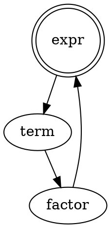
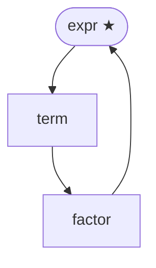

# Visualising a grammar

The examples on this page all use the same toy arithmetic grammar, saved as
`toy.bnf`:

```bnf
# arithmetic expressions
expr   -> term ('+' term)* ;
term   -> factor ('*' factor)* ;
factor -> /[0-9]+/ | '(' expr ')' ;
```

## Railroad diagrams

`ts-bnf-tool railroad` generates railroad / syntax diagrams as SVG — the same
style used by many language reference websites to show grammar rules visually.
No external binary is required; SVG is produced directly from Rust.

```sh
ts-bnf-tool railroad grammar.bnf                     # all rules, single SVG to stdout
ts-bnf-tool railroad -o grammar.svg grammar.bnf      # write to file
ts-bnf-tool railroad --rule expr grammar.bnf         # single named rule to stdout
ts-bnf-tool railroad --split --output-dir diagrams/ grammar.bnf  # one SVG per rule
```

Running `ts-bnf-tool railroad -o railroad.svg toy.bnf` on the toy grammar
above produces:


In single-file mode all rules are stacked vertically in one SVG document.
Each rule is wrapped in `<g id="rule-<name>">` so that non-terminal labels
link to `#rule-<name>` fragment anchors within the same file. In split mode
each rule gets its own `<name>.svg` file and labels link to `<name>.svg`
relative paths, enabling navigation when the directory is served as a static
site.

Non-terminal references to undefined rules still produce a valid diagram node;
a `warning:` is printed to stderr and exit code remains 0.

For a real-world example, see the
[railroad diagram of the BNF dialect's own grammar](https://github.com/ambs/tree-sitter-bnf-tools/blob/main/grammar/railroad.svg),
generated from
[`grammar/bnf.bnf`](https://github.com/ambs/tree-sitter-bnf-tools/blob/main/grammar/bnf.bnf).

## Rule-dependency graph

`ts-bnf-tool graph` emits a directed graph where every node is a grammar rule
and every edge points from a rule to each non-terminal it references. This is
useful for understanding which rules drive which others, spotting unused
sub-grammars, and auditing reachability.

```sh
ts-bnf-tool graph grammar.bnf                          # DOT to stdout (default)
ts-bnf-tool graph --format mermaid grammar.bnf         # Mermaid flowchart
ts-bnf-tool graph --format svg grammar.bnf             # SVG via Graphviz to stdout
ts-bnf-tool graph --format svg -o grammar.svg grammar.bnf
ts-bnf-tool graph --format pdf -o grammar.pdf grammar.bnf  # pdf/png require -o
ts-bnf-tool graph --start expression grammar.bnf       # reachable from `expression` only
```

For the toy grammar, `ts-bnf-tool graph toy.bnf` emits:



The same graph as Mermaid (`--format mermaid`):



And rendered to PNG with `ts-bnf-tool graph --format png -o graph.png toy.bnf`:


The **start symbol** (first production, or the rule named with `%axiom`) is
highlighted: `shape=doublecircle` in DOT and a `★` suffix in Mermaid.
Non-terminals that are referenced but never defined are shown with
`style=dashed` (DOT) or a `⚠` suffix (Mermaid), and a warning is printed to
stderr. The edge and the node are still emitted — the graph is never incomplete.
DOT node IDs are always quoted, so rule names that collide with Graphviz
keywords (`node`, `edge`, `graph`, …) remain valid.

Mermaid node IDs carry a trailing underscore (`expr_`) because Mermaid cannot
quote IDs and some rule names (`end`, `style`, `class`, …) are flowchart
keywords; the label in brackets always shows the real rule name, so rendered
diagrams are unaffected.

`--start <rule>` restricts the output to the subgraph reachable from the named
rule via BFS. Rules not reachable from it are silently omitted. The named rule
becomes the start symbol for styling purposes regardless of its position in the
file.

`svg`, `pdf`, and `png` formats shell out to `dot` (Graphviz). If `dot` is not
on your `PATH` the tool prints a clear error with the Graphviz install URL and
exits non-zero. `pdf` and `png` always require `-o` since they produce binary
output. For a real-world example, see the
[dependency graph of the BNF dialect's own grammar](https://github.com/ambs/tree-sitter-bnf-tools/blob/main/grammar/graph.pdf) (PDF),
generated from
[`grammar/bnf.bnf`](https://github.com/ambs/tree-sitter-bnf-tools/blob/main/grammar/bnf.bnf).

---

Previous: [Formatting and refactoring](09-refactoring.md) · Back to the [index](../index.md)
